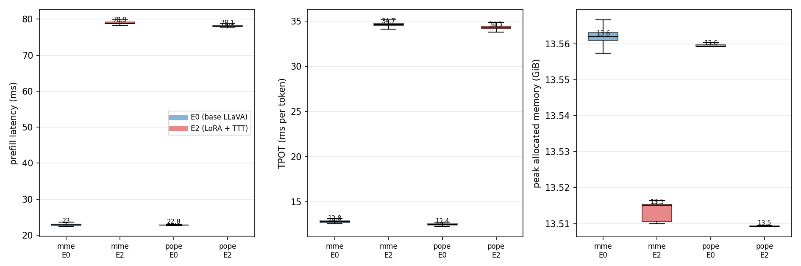
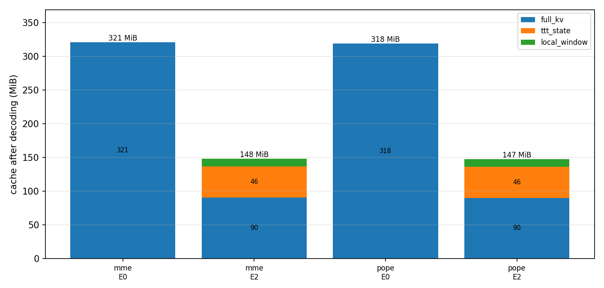
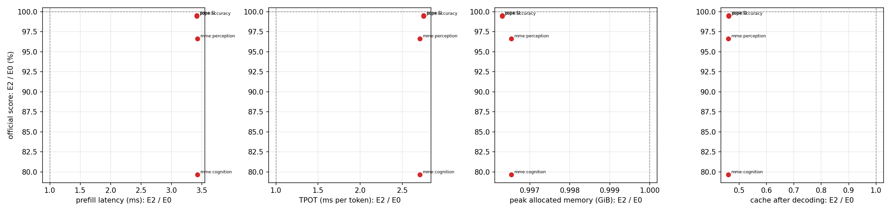

# Prefix-TTT（E2）H100 阶段总结：训练、评测分数与推理成本

本文件是 `docs/experiments/2026-09-10-prefix-ttt-h100/` 这一阶段的实验总结，对应主账本
[ledger.md](ledger.md)。账本保存逐次操作与决策，本文件只讲做了什么、结果是什么、结论是什么，
以及哪些事情没有做或做不了。所有数字都能在「原始数据」一节列出的文件中逐条复查。

## 1. 研究问题与这一阶段的定位

项目研究的是 **Prefix-TTT**：把部分 Transformer 层换成对前缀做测试时训练（TTT）的循环层，
希望用**恒定大小的循环状态**替代随上下文线性增长的全量 KV 缓存。本项目采用 **A9-T23** 布局——
32 层中 9 层保留全注意力（anchor，层号 `[0,3,7,11,15,19,23,27,31]`），其余 23 层为 TTT 层，
采用 Local-32 分块注意力加 token-inclusive 前缀 TTT，递推状态用 FP32。基座 LLaVA-1.5-7B 冻结，
训练 LoRA（rank 32、alpha 64）与 23 层 TTT 参数，共 517 个可训练张量。

这一阶段要回答的问题很窄，也很实际：**在同一台机器、同一批 benchmark、同一套 prompt 下，
TTT 版本（E2）相对基座（E0）多花了多少推理成本，换来了什么。** 因此分数与成本是**同批采集**的，
不存在「分数来自一次运行、延迟来自另一次运行」的口径错配。

## 2. 做了什么事

- **环境**：按 `pyproject.toml` / `uv.lock` 安装，未改动任何库版本；GPU 算子验收 17 项通过。
- **多机**：两台 8×H100 主机（`cucloud-server3` 与 `cucloud-server1`）用宿主机 NFS 共享产物目录，
  NCCL 走 IB/RDMA，all-reduce 实测 0.53–0.57 ms（16 rank）。
- **训练**：放弃 A40 迁移方案，按任务书从零重训。A 阶段（只训 TTT 参数）391 步，B 阶段
  （LoRA + TTT，完整轨迹）5182 步，16 卡跨两机，micro batch 8、全局 batch 128。
- **评测**：E0（基座）与 E2（LoRA + TTT）各跑 MME、POPE；正式分数与逐请求成本在**同一次运行**内采集。
- **归因**：单独测了 E0 与基座的注意力实现、算力与 kernel 数量，用来解释延迟差异（见第 5 节）。

## 3. 训练结果

| 阶段 | 步数 | 样本 | 卡数 | 耗时 | 损失 |
| --- | --- | --- | --- | --- | --- |
| A（TTT 参数） | 391 | 50000 | 16 | 7 分钟 | — |
| B（LoRA + TTT） | 5182 | 663248 | 16 | 3 小时 55 分 | 前 20 步均值 8.1691 → 末 20 步均值 0.7732 |

稳态 2.63 s/步（中位数，含每 25 步一次约 1.3 GB 的 NFS checkpoint 写入），全程无缺失步、
无非有限 loss 或梯度。

**跨机复现对照**：第 391 步（Pilot）末步交叉熵，旧机 4×A40（world=4、micro=1）为 1.10585，
本机 16×H100（world=16、micro=8）为 1.10140，相差 0.4%；末 20 步均值 1.14615 对 1.14717，
相差 0.09%。在硬件、卡数、微批分组都不同的条件下达到这个一致性，说明固定清单、样本顺序、
A 阶段初始化与全局损失归一化是忠实的。

## 4. 评测结果

### 4.1 分数

| 模型 | MME Perception | MME Cognition | POPE Accuracy | POPE F1 |
| --- | --- | --- | --- | --- |
| E0（基座 LLaVA-1.5-7B） | 1479.6432 | 349.2857 | 0.8548 | 0.8397 |
| E2（LoRA + TTT） | 1429.4893（−3.4%） | 278.2143（−20.3%） | 0.8501（−0.5%） | 0.8357（−0.5%） |

E2 的数字采自**合并 LoRA 后的推理口径**（2026-09-11 起这是唯一的推理路径）。同一模型在
未合并口径下是 MME 1415.7322 / 287.1429、POPE 0.8507 / 0.8363；两种口径的差别只来自把
LoRA 增量舍入进 bf16 基座权重这一次舍入，影响的请求比例是 MME 22/2374（0.9%）、
POPE 41/9000（0.46%）。**报告 E2 时应注明口径**；E0 没有 LoRA，不受影响。

**E2 在 POPE 上与基座基本持平，在 MME 上明显更低，且掉分集中在 Cognition 分项。**
这是本阶段最重要的负面结果：以目前的训练配方（5182 步、只训 LoRA 与 TTT 参数、基座冻结），
TTT 层没有在「感知 + 认知」这类综合能力上追平基座，认知类子任务退化接近两成。
Cognition 分项本身的量级远小于 Perception（约 350 对 1480），同样的绝对落差 62.1 分在比例上
被放大；单看一个 benchmark 不足以断言能力崩塌，但它**足以否定「已经追平基座」这一说法**。

### 4.2 推理成本

下表是逐请求成本的**中位数**（每个 benchmark 上万次请求的分布中心；图 1 给出四分位分布）。
两种模型的输入长度在同一 benchmark 下完全一致，因此可以直接相减。

| Benchmark | 模型 | 请求数 | 输入长度 | Prefill | TPOT | 峰值显存 | 缓存占用 |
| --- | --- | --- | --- | --- | --- | --- | --- |
| MME | E0 | 2374 | 642 | 23.0 ms | 12.8 ms | 13.56 GiB | 321.0 MiB |
| MME | E2 | 2374 | 641 | 78.9 ms | 34.7 ms | 13.51 GiB | 147.8 MiB |
| POPE | E0 | 9000 | 637 | 22.8 ms | 12.4 ms | 13.56 GiB | 318.5 MiB |
| POPE | E2 | 9000 | 636 | 78.1 ms | 34.3 ms | 13.51 GiB | 147.1 MiB |

*图 1：同一 benchmark 下 E0 与 E2 的逐请求成本分布（箱体为四分位，须为 1.5 倍四分位距内的极值）。*

E2 的**缓存不是一块，而是三块**；E0 的缓存则全部是全注意力 KV：

| 模型 | Full KV | TTT 状态 | Local-32 窗口 | 合计 |
| --- | --- | --- | --- | --- |
| E0（642 token） | 321.0 MiB | 0 | 0 | 321.0 MiB |
| E2（642 token） | 90.3 MiB | 46.0 MiB | 11.5 MiB | 147.8 MiB |

*图 2：解码结束后的缓存占用。E2 只有 9 个 anchor 层存 KV，因此 KV 部分是 E0 的 $9/32$；
TTT 状态与 Local-32 窗口是常数，不随长度增长。*

关键在于**增长方式**而不是单点数值：E0 每 token 增长 512 KiB（$32 \times 2 \times 32 \times 128 \times 2$ B），
E2 只增长 144 KiB（同样的量乘以 $9/32$，即只有 anchor 层在长）。按实测斜率外推，
128k 上下文时 E0 的 KV 需要约 64 GiB，已经超过单卡容量；E2 约 18 GiB，外加恒定的 57.5 MiB
状态与窗口。**这才是 TTT 的收益所在，也是它在短上下文里唯一站得住的理由。**

### 4.3 分数与成本的关系

*图 3：以 E0 为基准的比值（虚线为 1.0 倍 / 100%）。纵轴用比值而非绝对分数，是因为 MME 是
0–2000 的累加分、POPE 是准确率，绝对分数之间不可比。*

E2 用 **3.4 倍的 prefill 延迟、2.7 倍的 TPOT、0.996 倍的峰值显存**（合并 LoRA 后显存已略低于
E0），换来 **46% 的缓存占用**，代价是 MME Perception 保留 96.6%、MME Cognition 保留 79.7%、
POPE Accuracy 保留 99.5%。端到端评测墙钟时间：MME 244 s → 434 s，POPE 506 s → 1170 s
（优化前分别是 531 s 与 1534 s）。

## 5. 为什么 E2 更慢：是 kernel 效率，不是算力

一个自然的怀疑是「E0 用了 flash attention，我们的 TTT 没用」。实测结果否定了这个解释：

- **两者都用 PyTorch SDPA 的 flash kernel**（`attn_implementation=sdpa`，实际命中的是
  `pytorch_flash::flash_fwd_kernel`）。Dao-AILab 的 `flash_attn` 包在本项目中**从未安装**，
  也不是依赖项。
- 在 660 token（MME 的中位长度）上，计入的算力几乎相同：E0 8777 GFLOP，E2 8794 GFLOP。
  其中 flash attention 部分 E0 228.4 G（32 层全注意力），E2 72.7 G（9 个 anchor 层加 23 个
  Local-32 窗口）——**E2 的注意力算力只有 E0 的三分之一**，但 prefill 反而慢约 4 倍（该对比
  测于合并 LoRA 之前；合并后 benchmark 上的差距是 3.4 倍）。
- 差距来自 kernel 数量与访存，而不是算术量：同一次 prefill，E0 需要 1363 次 kernel launch，
  E2 需要 7506 次；一次 decode，E0 需要 1395 次，E2 需要 6411 次。kernel 数之比（4.6 倍）
  与 TPOT 之比（5.0 倍）几乎一致，说明 E2 的解码是**启动开销与访存受限**：为 FP32 递推状态
  服务的 cast、拷贝与逐 chunk 小矩阵乘占了大头（单步 decode 中有 224 个 batched GEMV、
  224 个 dot kernel、273 次 DtoD memcpy、271 次 fill）。E0 每层只有 4 个大 GEMM 加一次
  flash attention，一次吃完整个序列；E2 的 23 个 TTT 层每层要做 Local-32 窗口注意力、
  LoRA 下/上投影、以及带顺序依赖的 chunked delta rule 递推。

顺带一个容易忽略的事实：在这个长度上注意力只占 E0 总算力的 2.6%，prefill 主要由线性投影
决定，所以「换更快的注意力实现」在短上下文里救不了 prefill。E2 的劣势不在数学，
而在把矩阵乘拆成了大量小 kernel。

### 5.1 单步 decode 的 kernel 归因

用 `TorchDispatchMode` 统计一步 decode（生成 1 个 token）里所有 dispatcher 调用：
E0 2440 次（实测 1492 个 CUDA kernel），E2 10215 次（5953 个 kernel）。E2 的构成：

| 组件 | 次数/步 | 每层 | 主要算子 |
| --- | --- | --- | --- |
| 23 个 TTT 层的投影/rotary/mask/o_proj | 2208 | 96 | 其中 `mm` 276（12/层） |
| `features()`（`a_phi`/`b_phi` 两个 einsum + RMS） | 1702 | 74 | permute 460、view 368、unsqueeze 276、cast 184 |
| Local-32 缓存包装（cat、计数） | 943 | 41 | cat 92、index 92 |
| Local-32 打包 + SDPA | 759 | 33 | `nonzero`/`cumsum`/3× `index_copy` |
| `recurrent_step`（FP32 递推） | 851 | 37 | 3 次 cast、3 次 masked_fill、2 次 einsum |
| `readout()`（门控 + RMS） | 322 | 14 | 含 FP32 cast 往返 |
| 缓存写回 `set_layer` | 256 | 11 | where 110、cat 18 |
| 9 个 anchor 层 + MLP + 采样 | 3174 | — | — |

即 **TTT 层每 token 约 306 次 op，而 E0 的普通层只有 76 次**。三个结构性原因：
① 23 层每层都要做局部注意力、两组特征映射、递推和读出门控；
② LoRA 覆盖每层全部 7 个投影（`trainability.py` 校验 `layers × 7`），每个被包装的 Linear
等于「基座 mm + 2 个小 mm」，使每 token 的 `mm` 由 224 升到 672；
③ FP32/bf16 混用造成大量 cast 与逐元素 kernel（`rms_no_affine` 每层被调 3 次，
`recurrent_step` 显式关 autocast 后再 cast，单步 `_to_copy` 高达 900 次，E0 只有 133 次）。

由此得到一个可用的量级规律：**TPOT ≈ 每个 kernel 约 10 µs × kernel 条数**（E0 1395 个 →
12.8 ms，E2 6411 个 → 64.3 ms）。decode 慢的本质是 kernel 条数，而不是单个 kernel 慢。
若要与使用 eager attention 的历史数字对齐，必须 E0/E2 同时改用朴素注意力重跑——单独关掉
flash 只会把基线拖慢（E0 prefill +39%、TPOT +25%；E2 仅 +9%、+10%），并使注意力退化为
$O(L^2)$ 显存。

### 5.2 已实测的推理优化与候选方向

按"① LoRA 合并 → ② features/readout 融合 → ③ Local-32 decode 专用路径 → ④ FLA fused
recurrent"四项依次实施，每一项都在**同一进程内切换开关**做 A/B（同卡、同前缀、4 次中位数），
以保证条件一致：

| 变体 | prefill | TPOT | kernel/请求 | TPOT 加速 |
| --- | --- | --- | --- | --- |
| 基线（当前报告口径） | 115.6 ms | 81.3 ms | 51323 | ×1.00 |
| ① LoRA 合并进基座权重 | 94.9 | 61.2 | 38777 | ×1.33 |
| ③ Local-32 decode 专用路径 | 115.3 | 65.4 | 41983 | ×1.24 |
| **① + ③（最终保留）** | **94.5** | **46.7** | **29438** | **×1.74** |

**保留的两项**：①把 LoRA 增量折进冻结的基座权重（数学恒等，只损失一次 bf16 舍入），
使每 token 的矩阵乘从 672 个降到 224 个；③给解码写专用路径，用布尔掩码代替
`nonzero`/`cumsum`/`index_copy` 打包，把每层 71 个 kernel 压到 13 个，且不引入新的框架调用。

**被实测否定、已回退的两项**：②用 `torch.compile` 融合 RMS/features/readout 虽然把 kernel
数从 29441 降到 25209，TPOT 反而从 45.8 涨到 50.6 ms（微基准：解码形状下单次 RMS 的墙钟耗时
显式链 32.9 µs、编译版 47.4 µs）；④用 FLA 的 `fused_recurrent_linear_attn` 替换手写递推，
等价性通过（输出相对误差 1.07e-7），但 TPOT 从 46.7 涨到 48.9 ms。**在这个尺寸下，
框架每次调用的 Python/分派开销大于它所合并掉的若干次小 kernel 启动**，所以"减少工作量"
和"用同一原语折叠算子链"有效，"小 kernel 换成大框架 kernel"无效。

**推理服务口径（2026-09-11 起）**：LoRA 在加载后于内存中一次性合并进基座权重，**这是唯一的
推理路径**（运行时开关与"合并/未合并"对照代码已删除）；训练侧 LoRA 仍与基座分开，也不提供
导出合并权重的接口，因此 checkpoint 始终保留原始适配器、训练与续训不受影响。合并带来的
数值后果见下：MME 2374 条请求中 22 条回答改变，全部来自这一次 bf16 舍入；单独测 ③ 时分数与
回答逐位不变。同一口径下的成本中位数：prefill 101.5 → 78.9 ms、TPOT 64.3 → 34.7 ms、
峰值显存 13.845 → 13.515 GiB（LoRA 参数被合并后释放）、缓存不变。

**未实施的候选方向**：给 `features()`/Local-32 写真正融合的手写 Triton kernel（不是
Inductor 编译）、把若干逐元素算子合并到缓存写回里、用 CUDA graph 捕获固定形状的解码步。
这些都需要先解决"框架调用开销"这一层，否则与 ②④ 是同样的结果。

## 6. 没有做的、以及做不了的事

- **E1（另两种布局）没有训练**：用户决定本阶段只做 E0 与 E2 两组对照。
- **GQA 没有跑 E2**：用户决定取消；E0 的 GQA 分数存在，但没有 E2 对照，因此本总结不引用它。
- **FLOPs 没有进入 benchmark 测量**：用户决定本阶段只测延迟、显存与缓存。第 5 节的算力数字
  来自单独的一次测量，只用于归因。
- **长度曲线做不出来，改成了分布图**：MME、POPE、GQA 三个任务的输入长度全部落在 634–663
  token（576 个图像 token 加一句短问题），x 轴上没有可画的范围，任何「长度–延迟」曲线都会
  退化成两个点。这是数据本身的性质，不是测量遗漏；要拿到真正的长度曲线需要另跑受控长度扫描，
  本阶段按用户决定不做。代价是：**本总结只能说明「这个长度下谁快谁慢」，不能说明交点在哪里。**
- **端到端吞吐未测**：只测了单请求延迟，没有测批处理吞吐或并发场景。

## 7. 方法学与可信度

- **成本口径**：只包住官方 `generate_until` 里逐样本的那一次 `generate` 调用，用 CUDA event
  计每次前向；首个前向记为 prefill，其余记为 decode，TPOT 是**排除首个 token 后**生成后续
  token 的平均耗时。任务、prompt、评分逻辑一律未改——同一套 benchmark 在打点版里得到的分数
  与未打点版**逐位一致**（如 E0 MME 1479.6432 / 349.2857），说明打点没有干扰评测。
- **并发争用的检验**：打点跑批一度四个任务同时在 8 张卡上跑。用 e2-pope 自身的前 3000 条
  （四任务并发期）与后 3000 条（独占期）对比，prefill 95.9 ms 对 96.0 ms、TPOT 58.8 ms 对
  58.8 ms，**没有可测出的差异**，因此并发不构成对上述比较的威胁，也不需要在空闲机器上重测。
- **缓存分解**：E0 的缓存是普通 `DynamicCache`，按 K/V 张量求和；E2 是混合缓存，按层拆成
  anchor 层的 KV、TTT 层的递推状态、以及 Local-32 窗口。**只报告 Full KV 会漏掉 TTT 状态，
  所以三者都被拆开记录并全部计入「合计」。**
- **输入长度**：早期日志里 E0 记录的是展开后的位置数、E2 记录的是纯文本 token 数，基准不一致。
  本总结的长度一律由缓存字节数反推（E0 用 524288 B/token，E2 用 147456 B/token），并已用
  2374 对同序样本交叉验证（长度差均值 −0.001）。相关字段的修正已进入代码，后续跑批会直接
  记录 `prefill_positions`。
- **配置文件的真实作用**：`configs/base.json` 只有 `data_root`、`model_relative_path`、
  `full_attention_layers`、`candidate_ttt_layers`、`training.micro_batch_size`、
  `training.dataloader_workers` 六个键被代码读取；学习率、`betas`、`eps`、`grad_clip`、
  `matrix_weight_decay`、`max_expanded_length`、`lora.*`、`generation.*` 等键**当前不生效**，
  对应数值硬编码在代码里且与配置一致。这是本阶段选择保留的既有设计（改动会让现有 checkpoint
  的 `config_sha256` 身份失配），但读配置时要知道：**改这些键不会改变行为**。

## 8. 结论

1. **训练管线是可信的**：跨硬件、跨卡数、跨微批分组，第 391 步的交叉熵相差 0.4%。
2. **TTT 目前没有赢在速度上**：在 640 token 这个长度，E2 的 prefill 慢 3.4 倍、TPOT 慢 2.7 倍，
   峰值显存与 E0 持平（略低）。原因不是算力（两者计入的 FLOPs 几乎相同）而是 kernel 数量；
   第 5.2 节的两项优化已经把 TPOT 从 64.3 ms 降到 34.7 ms。
3. **TTT 赢在缓存的增长方式**：E2 的缓存只有 E0 的 46%，而且其中 57.5 MiB 是恒定值，
   随长度增长的部分只有 anchor 层的 KV（144 对 512 KiB/token）。长度越长这个优势越大，
   但本阶段的数据范围（634–663 token）无法展示交点。
4. **质量上 E2 尚未追平基座**：POPE 基本持平，MME Cognition 掉 17.8%。在把成本收益讲清楚之前，
   先要把这个差距解释清楚——这是下一步最该做的事。

## 9. 原始数据与产物

- 官方评测结果（每个任务一个 `<时间戳>_results.json`）：
  `/data/shared/weights/prefix-ttt/eval/{e0,e2}/{mme,pope}/`（未打点版与打点版分数一致）
- 打点版评测结果与逐请求成本日志：
  `/data/shared/weights/prefix-ttt/eval-instrumented/{e0,e2}/{mme,pope}/` 与
  `/data/shared/weights/prefix-ttt/eval-instrumented/cost/{e0,e2}-{mme,pope}.jsonl`
  （每行一条请求：输入长度、prefill 毫秒、TPOT 毫秒、逐 token 解码耗时、峰值显存、缓存三分解）
- 训练产物：`/data/shared/weights/prefix-ttt/training/{A,E2}/`（E2 的 `latest.pt` 为 5182 步终态）
- 绘图脚本与本文件所用图：`scripts/experiments/prefix_ttt_h100/plot_metrics.py`、`images/cost_by_task.png`、
  `images/cache_by_task.png`、`images/score_vs_cost.png`
- 机器可读的汇总：`metrics-summary.json`
