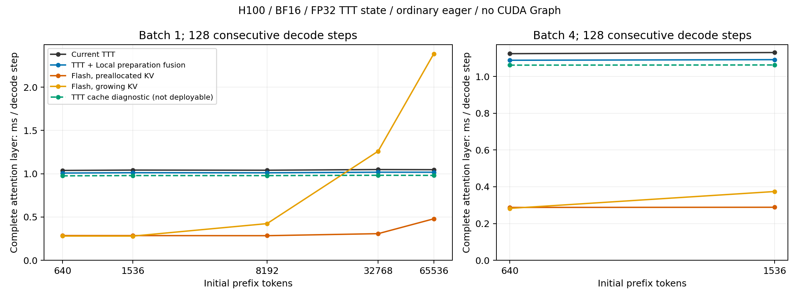

# 普通 eager decode 实验总结

本轮完成了真实 decode 热点归因、公平 Flash 基线、首个 Local 准备融合候选和单层五臂验证；整模型配对结果见下文。**当前没有达到 decode 超越静态 KV Flash 的目标。** 所有新实验均不使用 CUDA Graph，生产代码没有新增优化分支。

## 单层结果与为什么需要静态 KV 基线

H100、BF16、32头×128维、真实同一 checkpoint 的 QKV/O 权重；TTT 状态 FP32。每个样本包含前缀之后连续128个单 token调用，单层包含投影和完整缓存管理。两次预热，五轮×五次采样，同一GPU7交替顺序。下表为每次128步平均延迟的样本中位数，单位 ms/步；最后一列为相对当前生产实现的延迟下降。

| Batch | 初始前缀 | 当前TTT | Local融合候选 | Flash静态KV | Flash动态KV | cache诊断上界 | Local下降 |
|---|---:|---:|---:|---:|---:|---:|---:|
| 1 | 640 | 1.037933 | 1.007895 | 0.285517 | 0.279860 | 0.975361 | 2.89% |
| 1 | 1536 | 1.042040 | 1.011893 | 0.284991 | 0.279555 | 0.978645 | 2.89% |
| 1 | 8192 | 1.040367 | 1.010843 | 0.284157 | 0.423510 | 0.978140 | 2.84% |
| 1 | 32768 | 1.048198 | 1.017545 | 0.307465 | 1.260478 | 0.981863 | 2.92% |
| 1 | 65536 | 1.046707 | 1.017390 | 0.478947 | 2.384778 | 0.980288 | 2.80% |
| 4 | 640 | 1.123904 | 1.088174 | 0.287598 | 0.282296 | 1.061588 | 3.18% |
| 4 | 1536 | 1.130180 | 1.091447 | 0.288405 | 0.374063 | 1.062578 | 3.43% |

875个连续序列样本均完成。每个形状中，Local候选的五轮中位数都优于当前TTT，但收益只有2.80–3.43%。B1/640与1536约从1.04降到1.01ms，静态KV Flash则约0.285ms；候选仍需再降低约72%的延迟才达到持平。单独压缩Local准备链不是足以闭合差距的方案。

32K时，TTT已经快于每步拼接整段KV的DynamicCache基线，但静态KV Flash只需0.307ms。因此不能拿DynamicCache退化宣称TTT超越Flash。即使64K，候选1.017ms仍慢于静态KV的0.479ms。本轮没有观测到对静态KV Flash的交叉点；没有把曲线外推成已测结果。

cache诊断上界在B1下降约6%，B4下降约5.5–6%。这只是“将整段set_layer校验和保护全部拿掉”的消融结果，不是安全缓存方案的实测收益，也不能与Local收益直接相加。它不支持为缓存管理增加许多all-active/长度特判，更不能删除finished保护。

Flash基线是本项目锁定PyTorch 2.7.1的Flash SDPA，强制该后端，不允许静默fallback。长前缀只作为独立层硬件测量：本项目训练/评估协议主要在2048以内，基底配置上限4096，这些计时不证明长上下文模型质量。

## 真实模型配对

同一真实E2、B1、23个TTT层与9个全注意力层；每个样本重新prefill，之后用一对CUDA events包围连续128步，prefill与patch选择在计时外。每臂两次独立请求预热，五轮交替；timed循环内没有人为逐步同步、CPU复制或逐步event。以下仍是请求平均TPOT的样本中位数，单位ms/步。

| 前缀 | 当前生产 | Local融合候选 | 延迟下降 | 候选更快轮数 |
|---|---:|---:|---:|---:|
| 640 | 26.770309 | 26.087273 | 2.55% | 5/5 |
| 1536 | 26.922852 | 26.171539 | 2.79% | 5/5 |

两种长度五轮中的129位置×完整32064词表logits全部逐位一致，最大绝对误差为0，cache长度/计数/finished/FP32状态检查通过。该证据限于固定teacher-forced文本输入，并没有本阶段重新运行MME/POPE或图像质量评估。候选整模型收益为2.55–2.79%，与单层的微小收益一致，没有出现由算子加速推算出来的数倍收益。

新协议使用128步总体平均；旧历史measure为每步record event和GPU logits clone、循环后再CPU复制，并取单步时间中位数。本轮还显式关闭TF32，历史整模型记录允许TF32。因此不能把历史约27.3ms到本轮约26.8ms全归因于Local优化，应使用本轮同进程配对差值。本阶段没有重跑E0的这一新协议；对Flash的定量公平比较使用上面的完整单层五臂结果。

证据：[整模型原始结果](../../../artifacts/experiments/prefix_ttt_kernel/evidence/mamba-decode-model/results.json)、[脚本](../../../scripts/experiments/prefix_ttt_kernel/decode_model.py)。

## 为什么选Local，以及测量如何修正预期

真实E2连续decode的profile共覆盖两种前缀、六个active步、11838个kernel，全部独占归因。Local每层12个kernel，23个TTT层累计CPU inclusive约6.465ms；实际Local attention后端为efficient/CUTLASS，GPU核心约0.160ms，scatter约0.193ms，其余准备约0.365ms。详细表格与边界见[decode路线](decode_plan.md)。

这支持把Local准备作为首个有证据的候选，但不能预测省下6.465ms。实际无profiler完整层只省约0.03ms。CPU inclusive受采集扰动，也包含SDPA、包装与不能被该候选消除的工作；“热点范围大”与“某一融合收益大”是两件不同的事。本轮用完整层和整模型测量检验这一点。

当前decode走recurrent_decode，之前prefill的FLA chunk主机开销不是decode优化依据。Mamba启发的上一阶段优化显著改善了prefill，旧/新配对的decode基本不变；此次Local候选是另一个独立实验。

## 已验证、失败与没有采用的内容

Local候选只融合KV复制/scatter、visible mask与计数；SDPA及浮点归约保持原样，没有B1或特定长度分档。首次GPU验证因当前Triton不支持constexpr tuple索引而在编译阶段失败，未执行kernel；改为标量stride后，一次修复验证19项GPU测试全部通过。

测试包括BF16/FP32、B1/B4、非连续数据及metadata、无效行、跨32边界，以及完整层持续/中途finished、padding、旧state/KV/position不被修改。正式曲线再完成7形状×3对×128步，共2688次逐步输出与全部缓存一致检查。CPU有2项基准测试、2项Local测试、2项profile测试通过；这些数字与先前Mamba阶段测试分开。

cache上界仅存在实验脚本中。它绕过了形状/FP32检查和finished行合并，无法直接采用；特别是原Local对invalid token也会写不可见slot，finished行完整冻结仍需set_layer。没有删除这些工程能力或保护。

## 生产决策与下一步

本轮保留Local候选作为已测实验，不为约3%的单层收益叠加一条生产分派；现有生产实现维持不变。若后续统一整理decode实现，可以吸收这种准备链融合来替换原操作，但不将monkeypatch、cache上界和形状档位带入生产。

下一阶段的目标应按短上下文约0.285ms/层的实测Flash预算制定，至少分成两道门槛：先证明固定主机调用/数据准备可明显缩减，再检验完整层和模型是否获益。特征映射与recurrent是接下来的实测范围，优先隔离其主机包装、Q/K尾部联合launch与重复metadata处理；优化资格检查应在清晰的decode入口表达，不向forward不断追加形状分支。当前证据尚未证明这些改动能够带来所需的约3.5倍加速。

保留cuBLAS投影、原FP32读出归约和dtype舍入。历史自定义feature matvec/全融合recurrent曾改变25/2374个MME答案，因此涉及归约变化的方案必须重新做真实模型质量验收。kernel数下降或算子加速都不能代替完整层/模型的TPOT改善。若固定开销缩减仍不能达到预算，下一步应明确讨论算法额外分支与质量取舍，不能继续把细碎特判当作有保证的解法。

证据入口：[单层B1](../../../artifacts/experiments/prefix_ttt_kernel/evidence/mamba-decode-curve/b1-decode-curve.json)、[单层B4](../../../artifacts/experiments/prefix_ttt_kernel/evidence/mamba-decode-curve/b4-decode-check.json)、[GPU专项](../../../artifacts/experiments/prefix_ttt_kernel/evidence/mamba-decode-local-fixed/junit.xml)、[失败日志](../../../artifacts/experiments/prefix_ttt_kernel/evidence/mamba-decode-local-tests/local-prepare-exactness.log)、[主账本](ledger.md)。完整命令、环境、源码哈希、原始日志和队列状态保存在各evidence目录。
