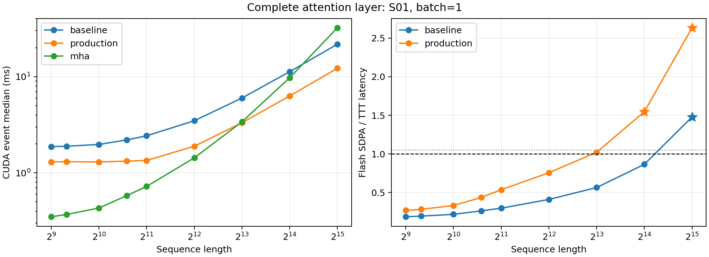
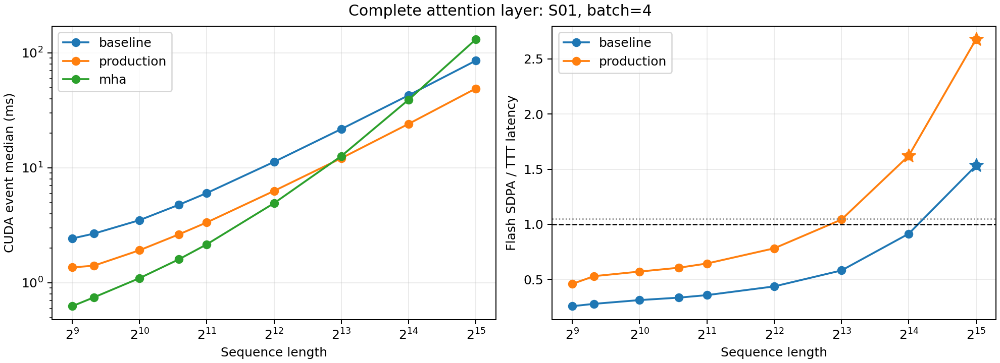
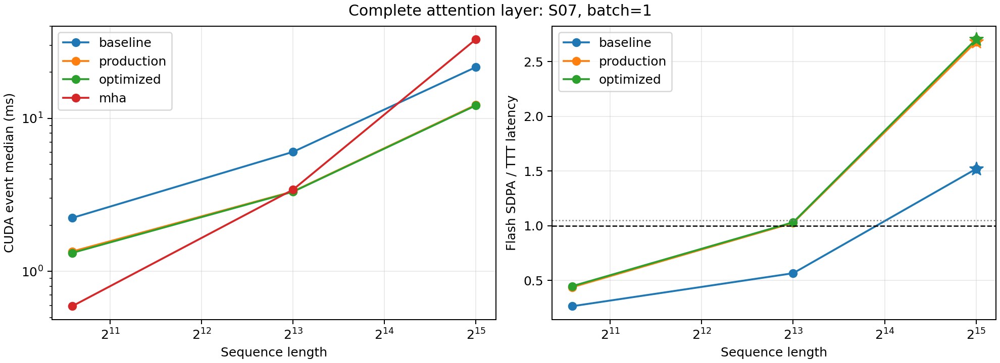
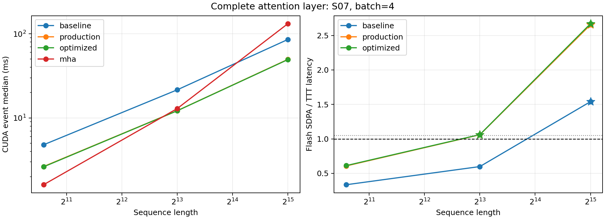

# Mamba 启发的 Prefix-TTT prefill：测量汇总

本文件由已有 JSON 生成。只汇总实际完成的测量；不同来源分别标记，不合并采样、不推算未测长度。最终采用方案、真实 checkpoint 质量回归与失败原因分析由阶段总结补充。

## 口径与边界

- Prefix-TTT 与 softmax MHA 计算不同函数；性能领先不代表质量等价。长度超过 2048 的结果仅用于硬件性能外推，不证明现有 checkpoint 的长上下文质量。
- 完整层计入 QKV/RoPE、TTT 特征和 Local-32、门控、输出投影与缓存生成；不包含共同 MLP。核心算子使用已准备 Q/K/V，不能代替完整层或完整模型速度。
- `production` 包含真实生产分派；`optimized` 是已知全有效输入的实验路径，可能省略生产有效性判定成本。表中优先展示 production，缺失时展示 optimized，并保留名称。
- 表中延迟以“CUDA Events / 同步墙钟”表示。CUDA Events 是调用的设备时间跨度，可能包含发射间隙，不能称为纯 kernel 执行时间；profiler 的 kernel 时间不混入计时样本。
- 加速比为 MHA CUDA 中位数除以对应 TTT CUDA 中位数。稳定领先要求至少五轮、总中位数加速比至少 1.05 且各轮均领先；少于五轮只记为轮次不足。
- 请求的初始/最终持久状态和递推累加器为 FP32；锁定 FLA 前向块边界中间状态为 BF16。块边界临时内存仍随序列增长，不能将持久缓存容量当作峰值运行显存。

## 数据来源

| 来源 | JSON | GPU | PyTorch | 完整层 tile | 轮数 | 每轮次数 | 权重 |
| --- | --- | --- | --- | --- | --- | --- | --- |
| S01 | [curve.json](../../../artifacts/experiments/prefix_ttt_kernel/evidence/mamba-final/curve.json) | NVIDIA H100 80GB HBM3 | 2.7.1+cu128 | 64 | 5 | 20 | checkpoint 层权重 |
| S02 | [profile.json](../../../artifacts/experiments/prefix_ttt_kernel/evidence/mamba-final/profile.json) | NVIDIA H100 80GB HBM3 | 2.7.1+cu128 | 64 | 5 | 20 | checkpoint 层权重 |
| S03 | [stack.json](../../../artifacts/experiments/prefix_ttt_kernel/evidence/mamba-final/stack.json) | NVIDIA H100 80GB HBM3 | 2.7.1+cu128 | 64 | 5 | 20 | 合成层权重 |
| S04 | [decode.json](../../../artifacts/experiments/prefix_ttt_kernel/evidence/mamba-final/decode.json) | NVIDIA H100 80GB HBM3 | 2.7.1+cu128 | 64 | 5 | 20 | checkpoint 层权重 |
| S05 | [real-correctness.json](../../../artifacts/experiments/prefix_ttt_kernel/evidence/mamba-calibration/real-correctness.json) | NVIDIA H100 80GB HBM3 | 2.7.1+cu128 | 64 | 5 | 20 | checkpoint 层权重 |
| S06 | [results.json](../../../artifacts/experiments/prefix_ttt_kernel/evidence/mamba-tile-fixed/results.json) | NVIDIA H100 80GB HBM3 | 2.7.1+cu128 | 64 | 5 | 20 | 合成层权重 |
| S07 | [results.json](../../../artifacts/experiments/prefix_ttt_kernel/evidence/mamba-ablation/results.json) | NVIDIA H100 80GB HBM3 | 2.7.1+cu128 | 64 | 5 | 20 | checkpoint 层权重 |
| S08 | [tile-ablation.json](../../../artifacts/experiments/prefix_ttt_kernel/evidence/mamba-calibration/tile-ablation.json) | NVIDIA H100 80GB HBM3 | 2.7.1+cu128 | 64 | 5 | 20 | 合成层权重 |

- S01 SHA256：`b1a104dc400a8a8bf5424afa163d891fec6f7c69caf15c3597f555a6a4eb9fd8`；seed=42；warmup=20；baseline commit=`eb3d2c61054686b596b2e407767f546ac99e9525`。
- S02 SHA256：`1b5fc5927892088041664ddba2b99b47efcf8abb0c9ec1d48ae51a9b60330a86`；seed=42；warmup=20；baseline commit=`eb3d2c61054686b596b2e407767f546ac99e9525`。
- S03 SHA256：`9ce173eae3edc1b4cc89fd8a840243ac33a89884f54af72bb3816c11c14f4a99`；seed=42；warmup=20；baseline commit=`eb3d2c61054686b596b2e407767f546ac99e9525`。
- S04 SHA256：`afdcca7e66b89c9ef7eabe8fc149264de8dfda856b8b533042669e4987c2c9a7`；seed=42；warmup=20；baseline commit=`eb3d2c61054686b596b2e407767f546ac99e9525`。
- S05 SHA256：`fd3adb283add507734418eb92a6d507843ebe856d6376c462835e3ae594590c2`；seed=42；warmup=20；baseline commit=`eb3d2c61054686b596b2e407767f546ac99e9525`。
- S06 SHA256：`8b0f3ebc04748a4f622d871fa36f7efffff4d14852d035f106e7486e6e4631de`；seed=42；warmup=20；baseline commit=`eb3d2c61054686b596b2e407767f546ac99e9525`。
- S07 SHA256：`4bd026ad40f643f33eb576d6f33c3a28b9561aab6906285903848f7d29618551`；seed=42；warmup=20；baseline commit=`eb3d2c61054686b596b2e407767f546ac99e9525`。
- S08 SHA256：`3c658474acdec50f5e87ad4a5cad924264bda1095c5c7343ab4ed3321691aa89`；seed=42；warmup=20；baseline commit=`eb3d2c61054686b596b2e407767f546ac99e9525`。

## 完整层 prefill

| 来源 | Batch | 长度 | Baseline ms | 候选 | 候选 ms | MHA ms | 加速比 | 稳定领先 |
| --- | --- | --- | --- | --- | --- | --- | --- | --- |
| S01 | 1 | 512 | 1.874 / 1.898 | production | 1.299 / 1.323 | 0.350 / 0.366 | 0.269 | 否 |
| S01 | 1 | 640 | 1.891 / 1.915 | production | 1.305 / 1.329 | 0.369 / 0.386 | 0.283 | 否 |
| S01 | 1 | 1024 | 1.974 / 1.998 | production | 1.298 / 1.322 | 0.431 / 0.451 | 0.332 | 否 |
| S01 | 1 | 1536 | 2.201 / 2.219 | production | 1.324 / 1.345 | 0.580 / 0.596 | 0.438 | 否 |
| S01 | 1 | 2048 | 2.428 / 2.445 | production | 1.346 / 1.363 | 0.722 / 0.739 | 0.537 | 否 |
| S01 | 1 | 4096 | 3.480 / 3.498 | production | 1.891 / 1.908 | 1.431 / 1.448 | 0.757 | 否 |
| S01 | 1 | 8192 | 6.000 / 6.018 | production | 3.320 / 3.338 | 3.391 / 3.408 | 1.021 | 否 |
| S01 | 1 | 16384 | 11.259 / 11.277 | production | 6.299 / 6.319 | 9.739 / 9.756 | 1.546 | 是 |
| S01 | 1 | 32768 | 21.759 / 21.777 | production | 12.223 / 12.240 | 32.174 / 32.192 | 2.632 | 是 |
| S01 | 4 | 512 | 2.431 / 2.449 | production | 1.361 / 1.378 | 0.626 / 0.643 | 0.460 | 否 |
| S01 | 4 | 640 | 2.678 / 2.696 | production | 1.409 / 1.427 | 0.747 / 0.764 | 0.530 | 否 |
| S01 | 4 | 1024 | 3.507 / 3.524 | production | 1.920 / 1.937 | 1.097 / 1.114 | 0.572 | 否 |
| S01 | 4 | 1536 | 4.772 / 4.789 | production | 2.638 / 2.655 | 1.600 / 1.617 | 0.607 | 否 |
| S01 | 4 | 2048 | 6.038 / 6.056 | production | 3.352 / 3.370 | 2.161 / 2.178 | 0.645 | 否 |
| S01 | 4 | 4096 | 11.278 / 11.296 | production | 6.299 / 6.316 | 4.928 / 4.945 | 0.782 | 否 |
| S01 | 4 | 8192 | 21.765 / 21.783 | production | 12.137 / 12.155 | 12.662 / 12.680 | 1.043 | 否 |
| S01 | 4 | 16384 | 42.787 / 42.805 | production | 24.134 / 24.152 | 39.146 / 39.163 | 1.622 | 是 |
| S01 | 4 | 32768 | 85.710 / 85.729 | production | 49.052 / 49.071 | 131.356 / 131.382 | 2.678 | 是 |
| S07 | 1 | 1536 | 2.235 / 2.256 | production | 1.349 / 1.372 | 0.592 / 0.609 | 0.439 | 否 |
| S07 | 1 | 8192 | 6.032 / 6.050 | production | 3.328 / 3.346 | 3.417 / 3.435 | 1.027 | 否 |
| S07 | 1 | 32768 | 21.580 / 21.599 | production | 12.232 / 12.250 | 32.795 / 32.813 | 2.681 | 是 |
| S07 | 4 | 1536 | 4.795 / 4.813 | production | 2.645 / 2.663 | 1.608 / 1.626 | 0.608 | 否 |
| S07 | 4 | 8192 | 21.560 / 21.578 | production | 12.176 / 12.195 | 12.907 / 12.925 | 1.060 | 是 |
| S07 | 4 | 32768 | 85.510 / 85.541 | production | 49.596 / 49.617 | 131.687 / 131.710 | 2.655 | 是 |

- S01，batch=1：稳定领先的已测长度为16384、32768；未据此推断未测交叉点。
- S01，batch=4：稳定领先的已测长度为16384、32768；未据此推断未测交叉点。
- S07，batch=1：稳定领先的已测长度为32768；未据此推断未测交叉点。
- S07，batch=4：稳定领先的已测长度为8192、32768；未据此推断未测交叉点。

图中星号表示达到稳定领先判据的观测点；线段仅连接观测值。墙钟中位数见表。

## 完整层显存

下表单位为 MiB。峰值增量是调用峰值 allocated 减调用前 allocated；临时超额是调用峰值减返回时 allocated；持久缓存为返回 cache 的张量容量。峰值增量包含返回输出和缓存，临时超额不等于所有临时张量分配量之和。

同进程中 TTT 参数及实验包装由比较臂共用并常驻，因此不将总峰值 allocated 解释为两个独立模型的绝对显存占用。新增 A/B 拼接 BF16 prepared buffer 在本轮 32 头、头维 128 下为每个 TTT 层 2 MiB；23 层合计 46 MiB，FP32 参数 master 不变。这是权重副本容量，不包含在请求缓存中。

| 来源 | Batch | 长度 | 变体 | 峰值增量 MiB | 临时超额 MiB | 持久缓存 MiB |
| --- | --- | --- | --- | --- | --- | --- |
| S01 | 1 | 512 | production | 45.289 | 38.787 | 2.501 |
| S01 | 1 | 512 | mha | 20.254 | 8.254 | 8.000 |
| S01 | 1 | 640 | production | 55.362 | 47.859 | 2.501 |
| S01 | 1 | 640 | mha | 25.318 | 10.318 | 10.000 |
| S01 | 1 | 1024 | production | 85.576 | 75.073 | 2.501 |
| S01 | 1 | 1024 | mha | 40.509 | 16.509 | 16.000 |
| S01 | 1 | 1536 | production | 125.862 | 111.359 | 2.501 |
| S01 | 1 | 1536 | mha | 60.763 | 24.763 | 24.000 |
| S01 | 1 | 2048 | production | 166.149 | 147.646 | 2.502 |
| S01 | 1 | 2048 | mha | 81.018 | 33.018 | 32.000 |
| S01 | 1 | 4096 | production | 327.295 | 292.790 | 2.504 |
| S01 | 1 | 4096 | mha | 162.035 | 66.035 | 64.000 |
| S01 | 1 | 8192 | production | 649.588 | 583.079 | 2.508 |
| S01 | 1 | 8192 | mha | 324.070 | 132.070 | 128.000 |
| S01 | 1 | 16384 | production | 1294.174 | 1163.657 | 2.516 |
| S01 | 1 | 16384 | mha | 648.141 | 264.141 | 256.000 |
| S01 | 1 | 32768 | production | 2583.346 | 2324.813 | 2.531 |
| S01 | 1 | 32768 | mha | 1296.281 | 528.281 | 512.000 |
| S01 | 4 | 512 | production | 181.137 | 155.134 | 10.002 |
| S01 | 4 | 512 | mha | 81.006 | 33.006 | 32.000 |
| S01 | 4 | 640 | production | 221.421 | 191.417 | 10.003 |
| S01 | 4 | 640 | mha | 101.257 | 41.257 | 40.000 |
| S01 | 4 | 1024 | production | 342.272 | 300.267 | 10.004 |
| S01 | 4 | 1024 | mha | 162.012 | 66.012 | 64.000 |
| S01 | 4 | 1536 | production | 503.407 | 445.399 | 10.006 |
| S01 | 4 | 1536 | mha | 243.018 | 99.018 | 96.000 |
| S01 | 4 | 2048 | production | 664.542 | 590.532 | 10.008 |
| S01 | 4 | 2048 | mha | 324.023 | 132.023 | 128.000 |
| S01 | 4 | 4096 | production | 1309.081 | 1171.063 | 10.016 |
| S01 | 4 | 4096 | mha | 648.047 | 264.047 | 256.000 |
| S01 | 4 | 8192 | production | 2598.159 | 2332.126 | 10.031 |
| S01 | 4 | 8192 | mha | 1296.094 | 528.094 | 512.000 |
| S01 | 4 | 16384 | production | 5176.315 | 4654.251 | 10.063 |
| S01 | 4 | 16384 | mha | 2592.188 | 1056.188 | 1024.000 |
| S01 | 4 | 32768 | production | 10332.627 | 9298.501 | 10.125 |
| S01 | 4 | 32768 | mha | 5184.375 | 2112.375 | 2048.000 |
| S07 | 1 | 1536 | production | 125.862 | 111.359 | 2.501 |
| S07 | 1 | 1536 | mha | 60.763 | 24.763 | 24.000 |
| S07 | 1 | 8192 | production | 649.588 | 583.079 | 2.508 |
| S07 | 1 | 8192 | mha | 324.070 | 132.070 | 128.000 |
| S07 | 1 | 32768 | production | 2583.346 | 2324.813 | 2.531 |
| S07 | 1 | 32768 | mha | 1296.281 | 528.281 | 512.000 |
| S07 | 4 | 1536 | production | 503.407 | 445.399 | 10.006 |
| S07 | 4 | 1536 | mha | 243.018 | 99.018 | 96.000 |
| S07 | 4 | 8192 | production | 2598.159 | 2332.126 | 10.031 |
| S07 | 4 | 8192 | mha | 1296.094 | 528.094 | 512.000 |
| S07 | 4 | 32768 | production | 10332.627 | 9298.501 | 10.125 |
| S07 | 4 | 32768 | mha | 5184.375 | 2112.375 | 2048.000 |

## 核心算子与 tile 消融

| 来源 | Batch | 长度 | 变体 / tile | CUDA / wall ms | 加速比 | 稳定领先 |
| --- | --- | --- | --- | --- | --- | --- |
| S06 | 1 | 512 | baseline-tile16 | 0.263 / 0.278 | 0.168 | 否 |
| S06 | 1 | 512 | optimized-tile16 | 0.200 / 0.214 | 0.221 | 否 |
| S06 | 1 | 512 | baseline-tile32 | 0.264 / 0.280 | 0.167 | 否 |
| S06 | 1 | 512 | optimized-tile32 | 0.197 / 0.213 | 0.224 | 否 |
| S06 | 1 | 512 | baseline-tile64 | 0.266 / 0.282 | 0.166 | 否 |
| S06 | 1 | 512 | optimized-tile64 | 0.202 / 0.217 | 0.218 | 否 |
| S06 | 1 | 512 | baseline-tile128 | 0.272 / 0.288 | 0.162 | 否 |
| S06 | 1 | 512 | optimized-tile128 | 0.206 / 0.222 | 0.214 | 否 |
| S06 | 1 | 512 | mha | 0.044 / 0.058 | — | 基准 |
| S06 | 1 | 1536 | baseline-tile16 | 0.296 / 0.311 | 0.449 | 否 |
| S06 | 1 | 1536 | optimized-tile16 | 0.236 / 0.250 | 0.564 | 否 |
| S06 | 1 | 1536 | baseline-tile32 | 0.280 / 0.295 | 0.474 | 否 |
| S06 | 1 | 1536 | optimized-tile32 | 0.218 / 0.232 | 0.610 | 否 |
| S06 | 1 | 1536 | baseline-tile64 | 0.273 / 0.287 | 0.487 | 否 |
| S06 | 1 | 1536 | optimized-tile64 | 0.210 / 0.224 | 0.633 | 否 |
| S06 | 1 | 1536 | baseline-tile128 | 0.279 / 0.293 | 0.477 | 否 |
| S06 | 1 | 1536 | optimized-tile128 | 0.214 / 0.228 | 0.622 | 否 |
| S06 | 1 | 1536 | mha | 0.133 / 0.147 | — | 基准 |
| S06 | 1 | 8192 | baseline-tile16 | 1.084 / 1.099 | 1.613 | 是 |
| S06 | 1 | 8192 | optimized-tile16 | 0.670 / 0.685 | 2.610 | 是 |
| S06 | 1 | 8192 | baseline-tile32 | 0.874 / 0.888 | 2.002 | 是 |
| S06 | 1 | 8192 | optimized-tile32 | 0.459 / 0.473 | 3.814 | 是 |
| S06 | 1 | 8192 | baseline-tile64 | 0.775 / 0.789 | 2.258 | 是 |
| S06 | 1 | 8192 | optimized-tile64 | 0.362 / 0.376 | 4.832 | 是 |
| S06 | 1 | 8192 | baseline-tile128 | 0.761 / 0.776 | 2.297 | 是 |
| S06 | 1 | 8192 | optimized-tile128 | 0.353 / 0.367 | 4.959 | 是 |
| S06 | 1 | 8192 | mha | 1.749 / 1.764 | — | 基准 |
| S06 | 1 | 32768 | baseline-tile16 | 4.180 / 4.195 | 5.789 | 是 |
| S06 | 1 | 32768 | optimized-tile16 | 2.450 / 2.464 | 9.879 | 是 |
| S06 | 1 | 32768 | baseline-tile32 | 3.311 / 3.326 | 7.308 | 是 |
| S06 | 1 | 32768 | optimized-tile32 | 1.585 / 1.600 | 15.267 | 是 |
| S06 | 1 | 32768 | baseline-tile64 | 2.899 / 2.914 | 8.347 | 是 |
| S06 | 1 | 32768 | optimized-tile64 | 1.173 / 1.188 | 20.623 | 是 |
| S06 | 1 | 32768 | baseline-tile128 | 2.833 / 2.848 | 8.541 | 是 |
| S06 | 1 | 32768 | optimized-tile128 | 1.104 / 1.118 | 21.923 | 是 |
| S06 | 1 | 32768 | mha | 24.198 / 24.213 | — | 基准 |
| S06 | 4 | 512 | baseline-tile16 | 0.311 / 0.326 | 0.259 | 否 |
| S06 | 4 | 512 | optimized-tile16 | 0.252 / 0.267 | 0.319 | 否 |
| S06 | 4 | 512 | baseline-tile32 | 0.290 / 0.305 | 0.277 | 否 |
| S06 | 4 | 512 | optimized-tile32 | 0.227 / 0.241 | 0.355 | 否 |
| S06 | 4 | 512 | baseline-tile64 | 0.281 / 0.295 | 0.287 | 否 |
| S06 | 4 | 512 | optimized-tile64 | 0.218 / 0.233 | 0.369 | 否 |
| S06 | 4 | 512 | baseline-tile128 | 0.289 / 0.303 | 0.278 | 否 |
| S06 | 4 | 512 | optimized-tile128 | 0.228 / 0.242 | 0.353 | 否 |
| S06 | 4 | 512 | mha | 0.080 / 0.095 | — | 基准 |
| S06 | 4 | 1536 | baseline-tile16 | 0.826 / 0.840 | 0.388 | 否 |
| S06 | 4 | 1536 | optimized-tile16 | 0.527 / 0.541 | 0.608 | 否 |
| S06 | 4 | 1536 | baseline-tile32 | 0.672 / 0.687 | 0.477 | 否 |
| S06 | 4 | 1536 | optimized-tile32 | 0.374 / 0.388 | 0.858 | 否 |
| S06 | 4 | 1536 | baseline-tile64 | 0.598 / 0.613 | 0.535 | 否 |
| S06 | 4 | 1536 | optimized-tile64 | 0.301 / 0.315 | 1.065 | 是 |
| S06 | 4 | 1536 | baseline-tile128 | 0.599 / 0.614 | 0.535 | 否 |
| S06 | 4 | 1536 | optimized-tile128 | 0.309 / 0.323 | 1.035 | 否 |
| S06 | 4 | 1536 | mha | 0.320 / 0.335 | — | 基准 |
| S06 | 4 | 8192 | baseline-tile16 | 4.181 / 4.196 | 1.460 | 是 |
| S06 | 4 | 8192 | optimized-tile16 | 2.488 / 2.503 | 2.453 | 是 |
| S06 | 4 | 8192 | baseline-tile32 | 3.360 / 3.375 | 1.816 | 是 |
| S06 | 4 | 8192 | optimized-tile32 | 1.668 / 1.682 | 3.659 | 是 |
| S06 | 4 | 8192 | baseline-tile64 | 2.873 / 2.887 | 2.125 | 是 |
| S06 | 4 | 8192 | optimized-tile64 | 1.175 / 1.189 | 5.195 | 是 |
| S06 | 4 | 8192 | baseline-tile128 | 2.803 / 2.817 | 2.178 | 是 |
| S06 | 4 | 8192 | optimized-tile128 | 1.101 / 1.115 | 5.546 | 是 |
| S06 | 4 | 8192 | mha | 6.104 / 6.118 | — | 基准 |
| S06 | 4 | 32768 | baseline-tile16 | 16.917 / 16.932 | 5.905 | 是 |
| S06 | 4 | 32768 | optimized-tile16 | 10.215 / 10.230 | 9.779 | 是 |
| S06 | 4 | 32768 | baseline-tile32 | 13.613 / 13.629 | 7.337 | 是 |
| S06 | 4 | 32768 | optimized-tile32 | 6.904 / 6.919 | 14.468 | 是 |
| S06 | 4 | 32768 | baseline-tile64 | 11.446 / 11.465 | 8.727 | 是 |
| S06 | 4 | 32768 | optimized-tile64 | 4.738 / 4.753 | 21.080 | 是 |
| S06 | 4 | 32768 | baseline-tile128 | 11.036 / 11.051 | 9.051 | 是 |
| S06 | 4 | 32768 | optimized-tile128 | 4.326 / 4.343 | 23.090 | 是 |
| S06 | 4 | 32768 | mha | 99.886 / 99.904 | — | 基准 |

## 多层串联

各来源的层数：S01=4；S02=4；S03=4；S04=4；S05=4；S06=4；S07=4；S08=4。层权重是否独立或重复，以原始 JSON 的 `protocol.stack_weights` 为准。

| 来源 | Batch | 长度 | Baseline ms | 候选 | 候选 ms | MHA ms | 加速比 | 稳定领先 |
| --- | --- | --- | --- | --- | --- | --- | --- | --- |
| S03 | 1 | 1536 | 7.878 / 7.900 | production | 3.944 / 3.970 | 1.797 / 1.815 | 0.456 | 否 |
| S03 | 1 | 8192 | 23.144 / 23.164 | production | 12.238 / 12.257 | 12.762 / 12.782 | 1.043 | 否 |
| S03 | 1 | 32768 | 85.100 / 85.120 | production | 47.537 / 47.574 | 128.870 / 128.897 | 2.711 | 是 |
| S03 | 4 | 1536 | 18.166 / 18.185 | production | 9.475 / 9.493 | 5.619 / 5.637 | 0.593 | 否 |
| S03 | 4 | 8192 | 84.871 / 84.893 | production | 47.375 / 47.395 | 51.838 / 51.857 | 1.094 | 是 |
| S03 | 4 | 32768 | 340.658 / 340.683 | production | 194.661 / 194.695 | 514.980 / 515.012 | 2.646 | 是 |

## 固定输入 decode

延迟为整段 decode 总时间除以步数，属于平均每步耗时，不是逐 token 延迟中位数。长度列表示初始前缀；加速比与稳定判据来自整段计时。各来源步数：S01=128；S02=128；S03=128；S04=128；S05=128；S06=128；S07=128；S08=128。

| 来源 | Batch | 长度 | Baseline ms | 候选 | 候选 ms | MHA ms | 加速比 | 稳定领先 |
| --- | --- | --- | --- | --- | --- | --- | --- | --- |
| S04 | 1 | 640 | 1.030 / 1.030 | production | 1.032 / 1.032 | 0.273 / 0.273 | 0.265 | 否 |
| S04 | 1 | 1536 | 1.030 / 1.031 | production | 1.035 / 1.035 | 0.273 / 0.273 | 0.264 | 否 |

## 已执行的数值正确性

下表仅汇总 correctness stage 对冻结 TTT 基线的结果。误差列取该来源所有已测配置的最大相对 L2 误差；stage 与变体的 passed 分别按 JSON 原值计数，不把缺失记录算作通过，也不代替任务质量评估。

| 来源 | 变体 | Stage 通过/配置数 | 变体通过/配置数 | 输出最大相对 L2 | 状态最大相对 L2 |
| --- | --- | --- | --- | --- | --- |
| S05 | production | 18/18 | 18/18 | 0 | 0 |
| S07 | dense | 6/6 | 6/6 | 0 | 0 |
| S07 | features | 6/6 | 6/6 | 0 | 0 |
| S07 | optimized | 6/6 | 6/6 | 0 | 0 |
| S07 | production | 6/6 | 6/6 | 0 | 0 |
| S07 | tile128 | 6/6 | 6/6 | 0.00169628 | 0 |

## 失败与证据完整性

| 来源 | 失败配置 | 类型 | 信息 |
| --- | --- | --- | --- |
| S08 | core-b1-t512 | AttributeError | 'function' object has no attribute 'tensor_bytes' |

失败配置没有被补成零耗时；上表前的成功测量只是该文件中已完成的部分。

Flash 算子验证仅列出实际 profile 配置，不推广到未 profile 的配置。kernel 数取 JSON 的 `kernel_count`，不额外加总 CPU/GPU 标记、Memcpy 或 Memset；内核数量减少本身不代表延迟降低。

| 来源 | 配置 | Baseline kernel 数 | 候选 | 候选 kernel 数 | MHA kernel 数 | 观察到 Flash SDPA |
| --- | --- | --- | --- | --- | --- | --- |
| S02 | profile-b1-t1536 | 119 | production | 61 | 17 | 是 |
| S02 | profile-b1-t32768 | 120 | production | 60 | 17 | 是 |

本生成器不替代数值正确性、MME/POPE 或调度器完成状态验收。原始样本、配置、源码指纹及其他阶段记录保留在来源 JSON 中。
