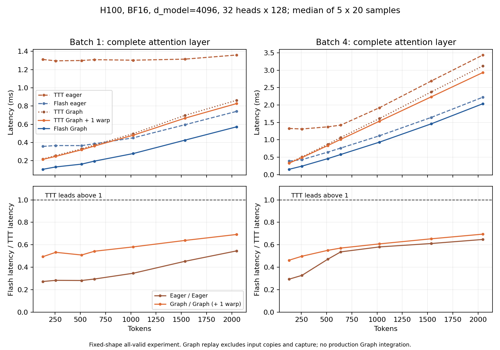

# 历史性能对齐与短序列优化实验

本阶段于2026-09-17完成，续接同一项目的[Mamba优化阶段](mamba_summary.md)。结论是：当前实现确实比历史packed版本更快；在相同协议、同进程配对的整语言模型文本prefill中，640/1536 token延迟分别降低38.2%/37.2%。但短序列超越Flash的目标尚未达到。双方都使用CUDA Graph后，128–2048 token的14组完整注意力层测量仍由Flash领先。

本阶段新增了实验脚本和验证，没有进一步修改生产实现。1warp配置与CUDA Graph均保留为实验候选，不能把本页Graph数字理解为当前服务已经具有的性能。

2026-09-17后续约束更新：用户已明确后续不使用CUDA Graph。本页Graph实验仅为历史记录；AB投影与SiLU/RMS融合降为待验证候选，下一项优化优先级由真实普通eager路径的热点归因与完整层/整模型消融决定，补测与可读性审查见[后续报告](eager_review.md)。

## 1. 历史数据应该怎样比较

历史表中的58.800/81.738 ms来自完整语言模型，不能与上一阶段1.305/1.324 ms的单个注意力替换层直接比较。为解决这一口径问题，本次复用[历史请求函数](../../../scripts/experiments/prefix_ttt_kernel/measure.py)，加载同一份E2真实权重，让冻结的旧packed执行路径和当前生产执行路径交替运行。

旧packed基线固定为提交`eb3d2c61054686b596b2e407767f546ac99e9525`，冻结attention forward、feature pair及cache begin/finish，验证其余相关依赖未变化。当前cache构造只多一个初值为False的标记；双方共用已准备好的额外46 MiB AB权重副本，准备时间不计入测量。不能直接沿用原measure脚本更早的`16d67fe`基线，否则会把之前已经完成的优化再次计为新收益。

协议保持B1、640/1536 token、同一段固定文本、128个teacher-forced decode步、两次预热、三轮交替。prefill取三轮CUDA Events中位数，TPOT取384个decode样本的合并中位数。测量覆盖32个decoder层、MLP和LM head；没有执行视觉编码器和图像投影，也不是完整greedy生成请求。同期E0在同一进程单独加载测量，E0/E2不是同一个数学模型。

| 前缀长度 | 9月11日旧packed记录 | 本次旧packed重测 | 当前生产实现 | 配对prefill降幅 | 同期E0 |
|---:|---:|---:|---:|---:|---:|
| 640 | 58.800 ms | 53.999 ms | 33.391 ms | 38.16% | 23.346 ms |
| 1536 | 81.738 ms | 79.083 ms | 49.674 ms | 37.19% | 47.957 ms |

当前实现比历史记录更快，但旧packed重测本身也比历史快8.16%/3.25%。因此，38.16%/37.19%的同进程配对降幅才是本轮代码收益的主要证据。其他负载、频率和主机环境没有逐项隔离，不能断言跨运行漂移的具体原因。历史与本次整模型测量均为H100、PyTorch 2.7.1+cu128、TF32允许。

| 前缀长度 | 本次旧packed TPOT | 当前TPOT | 同期E0 TPOT | 旧/新128步forward-loop墙钟 |
|---:|---:|---:|---:|---:|
| 640 | 27.280 ms | 27.290 ms | 10.971 ms | 3555.111 / 3536.002 ms |
| 1536 | 27.380 ms | 27.335 ms | 11.467 ms | 3601.067 / 3556.915 ms |

Decode没有实质改善，长达128步的循环仍由decode主导，墙钟仅降低约0.54%/1.23%。该墙钟含logits采集，不能当成完整用户请求延迟。尤其不能将历史约32 ms的TPOT到本次约27 ms的差异归因于此次prefill优化：本次旧packed也约为27 ms。

两个长度的三轮新旧比较全部逐位一致，每轮检查形状为`[129,1,32064]`的完整采样logits：有限值、argmax、最大绝对误差和相对L2均通过，两个误差均为0；同一实现跨轮重复也一致。同期E0的prefill仍快于当前E2，1536的差距约3.58%，640约43.0%；decode差距仍明显。

证据：[整模型结果](../../../artifacts/experiments/prefix_ttt_kernel/evidence/mamba-short-history/results.json)、[配置](../../../artifacts/experiments/prefix_ttt_kernel/evidence/mamba-short-history/manifest.json)、[脚本](../../../scripts/experiments/prefix_ttt_kernel/short_history.py)。历史原始数字保留在[640](../../../artifacts/experiments/prefix_ttt_kernel/evidence/packed-probe/640.json)与[1536](../../../artifacts/experiments/prefix_ttt_kernel/evidence/packed-probe/1536.json)，没有覆盖。

## 2. 用双方Graph排除不公平的短序列优势

上一阶段已经确认完整注意力层的640/1536延迟从1.891/2.201 ms降到1.305/1.324 ms。短序列仍慢，可能同时来自主机发射开销和TTT额外的GPU工作。CUDA Graph可以诊断前一部分，但必须让Flash也使用Graph；只比较Graph TTT与eager Flash，会把执行方式不同误当成算法获胜。

本次[Graph脚本](../../../scripts/experiments/prefix_ttt_kernel/short_graph.py)复用真实E2的第一个TTT层权重，双方共用QKV/O投影和输入；层宽4096、32头、头维128、BF16、FP32请求状态，TF32关闭。TTT包含QKV、RoPE、特征映射、Local-32、前缀状态与readout、门控、O投影及新缓存。Flash对照是强制PyTorch `FLASH_ATTENTION`后端的完整多头自注意力层。两者计算不同函数，公平性指接口、形状和计时范围对齐。

在现有4warp逐元素kernel之外，本次增加[1warp实验包装](../../../scripts/experiments/prefix_ttt_kernel/short_ops.py)，只改变launch配置，复用完全相同的Triton算术和舍入点。16项GPU测试覆盖BF16/FP32、非连续输入、31/32/33边界及无效行，结果逐位一致；另有4项CPU恢复/回退测试通过。

正式测量覆盖B1/B4、128/256/512/640/1024/1536/2048，每项20次预热、5轮×20次交替采样。每个配置同时测三种实现的eager和Graph，共8400条原始样本。下表均为完整层CUDA Events中位数，单位ms。

| Batch | Token | eager TTT | eager Flash | Graph TTT | Graph TTT+1warp | Graph Flash |
|---:|---:|---:|---:|---:|---:|---:|
| 1 | 128 | 1.311 | 0.357 | 0.219 | 0.215 | 0.106 |
| 1 | 256 | 1.296 | 0.367 | 0.257 | 0.248 | 0.132 |
| 1 | 512 | 1.300 | 0.366 | 0.330 | 0.320 | 0.163 |
| 1 | 640 | 1.309 | 0.386 | 0.373 | 0.362 | 0.196 |
| 1 | 1024 | 1.303 | 0.451 | 0.498 | 0.480 | 0.279 |
| 1 | 1536 | 1.315 | 0.595 | 0.698 | 0.667 | 0.426 |
| 1 | 2048 | 1.360 | 0.742 | 0.863 | 0.827 | 0.572 |
| 4 | 128 | 1.326 | 0.389 | 0.340 | 0.330 | 0.153 |
| 4 | 256 | 1.312 | 0.429 | 0.509 | 0.491 | 0.244 |
| 4 | 512 | 1.373 | 0.647 | 0.873 | 0.836 | 0.460 |
| 4 | 640 | 1.422 | 0.763 | 1.068 | 1.014 | 0.578 |
| 4 | 1024 | 1.923 | 1.117 | 1.613 | 1.536 | 0.934 |
| 4 | 1536 | 2.688 | 1.643 | 2.374 | 2.233 | 1.458 |
| 4 | 2048 | 3.436 | 2.224 | 3.121 | 2.933 | 2.037 |

Graph确实显著减少短序列调用开销，但双方Graph后的TTT仍慢。1warp带来约1.020–1.064倍的Graph加速，无法消除主要差距。以B1为例，640/1536/2048的Graph+1warp若要追平Flash，还需分别减少约45.8%/36.2%/30.8%的当前延迟。原始分轮中位数和分位数均保存在[正式结果](../../../artifacts/experiments/prefix_ttt_kernel/evidence/mamba-short-graph/results.json)，不是只保留最快样本；图由[制图脚本](../../../scripts/experiments/prefix_ttt_kernel/short_plot.py)写入本文的images目录。

Graph重放必须证明没有少算工作。脚本先生成新cache进行捕获，再验证原输入、改变输入、重复改变后的输入、恢复原输入四种情况；比较输出、FP32状态、Local KV、位置、有效性历史与序列长度。728个浮点字段比较、560个整数/布尔字段比较全部equal，包括1warp对原优化版。改变输入确实改变输出和有效缓存内容，没有发现状态累积。

这些结果仍有明确边界。Graph是固定形状、预备权重、已知全有效首次prefill实验，跳过了生产每请求的有效性主机判定；replay不含输入复制、Python对象构造、编译、预热和捕获。Graph内包含设备缓存初始化，但静态输出/缓存会被下次replay覆写，尚未实现生产请求隔离与生命周期管理。所有性能采样长度均为32的倍数，不证明Graph已支持尾块、padding、动态形状或并发。eager事件时间可能包含主机发射造成的GPU空等，不能把eager与Graph的差值都解释为算术量下降。

## 3. 为什么只调warp不够，下一步具体融合什么

已有[1536 profile](../../../artifacts/experiments/prefix_ttt_kernel/evidence/mamba-final/profile.json)中，TTT的kernel总时间约675.6微秒，MHA约412.7微秒。TTT的两次SiLU/RMS合计84.0微秒，readout约43.8微秒；两次AB特征GEMM约28.3微秒，FLA状态和输出约50.2微秒，Local约45.9微秒，gate约10.5微秒，V乘ETA约10.0微秒。MHA的完整Flash核约102.6微秒。这些是独立profile下的预算，不可与未profile的层延迟直接相减，也不是硬件理论下界。

即使把现有三次归一化尾部假设成零成本，仅AB、FLA、Local和gate也约135微秒，已超过对照Flash核心约103微秒，尚未计入ETA与缓存等。这个乐观预算解释了为什么调warp只能小幅改善：要在短序列领先，必须让跨算子的数据流更紧凑，同时减少实际GPU工作。

此前提出的待验证候选是**特征AB投影与SiLU/RMS尾部融合**，现有证据尚不足以将其定为下一步优先实现方向。当前两次GEMM先写出Q/K各自的A/B投影，再由两个kernel读回、激活、逐项乘积和归一化。新候选可让一个program处理某个head的16或32个token，用Tensor Core完成128×256的AB投影，在片上保留结果，直接写Qf/Kf。通过grid维度选择Q或K，避免为融合先做stack/cat。

设总模型维度为$D$，两个GEMM的BF16中间输出共有$4BTD$个元素。取消一次写入和一次读回，理论上减少的中间传输为

$$
4BTD\times 2\ \mathrm{bytes}\times 2=16BTD\ \mathrm{bytes}.
$$

在B1、D4096下，640/1536分别对应40/96 MiB，并可将两个GEMM加两个尾部kernel合为一次发射。这是可消除的张量流量，不是已经测得的延迟收益；底层缓存、occupancy和GEMM效率会影响结果。

精度验收必须保持投影、SiLU、乘积与归一化的BF16舍入点，以及FP32 master和请求状态。替换cuBLAS GEMM后，Tensor Core归约顺序可能变化，不能预先承诺逐位一致。建议先比较投影与Qf/Kf，再比较完整层输出及FP32最终状态，仍用现有2%输出/1%状态误差界；通过后再以真实模型logits和MME/POPE验收。没有运行质量回归前不得采用为生产版本。

如果先要求严格逐位一致，可以尝试每CTA处理四行、每行一个warp的尾部布局，保留当前加法顺序，降低CTA数量；还可在保持BF16舍入的前提下把ETA乘法并入FLA的V读取。但这些只能作为小收益候选，不能承担短序列胜出的主要预期。

不优先直接融合FLA输出与readout：当前FLA输出kernel的每个CTA只生成64个V通道，而RMS需要完整128维归约。合并两个tile会改变寄存器压力和计算安排，需要独立设计和验证，不能视作简单添加epilogue。

这一阶段没有实现上述跨GEMM融合，也没有删除既有tile或decode能力。本轮实际完成的是历史对齐、Graph诊断、1warp候选验证及收益预算。短序列领先仍是下一阶段要检验的研究目标，现有证据既不能宣称已经实现，也不足以证明数学上不可能。

## 4. 交付与可复核状态

所有本阶段GPU作业仅在物理GPU7由Supervisor托管SQLite队列串行执行，无失败或自动重试；旧阶段成功任务没有重复提交。配置、源码哈希、GPU测试JUnit及结果分别在[mamba-short-smoke](../../../artifacts/experiments/prefix_ttt_kernel/evidence/mamba-short-smoke/manifest.json)、[mamba-short-graph](../../../artifacts/experiments/prefix_ttt_kernel/evidence/mamba-short-graph/manifest.json)和[mamba-short-history](../../../artifacts/experiments/prefix_ttt_kernel/evidence/mamba-short-history/manifest.json)。日志及状态快照归档在[mamba-short-history](../../../artifacts/experiments/prefix_ttt_kernel/evidence/mamba-short-history/queue-status.json)，原SQLite和运行日志保留于`artifacts/mamba-kernel/short-*/`。

生产保留上一阶段已经通过203项CPU、84项GPU及11374条回答回归的Mamba优化实现；本阶段新增1warp专项为4项CPU与16项GPU通过，不将上一阶段测试数误报为本次重跑。未创建Git提交或推送。
