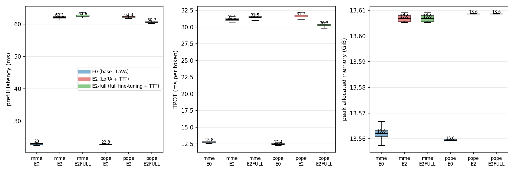
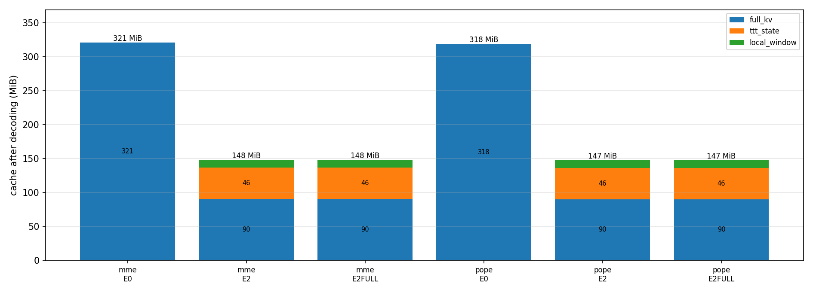
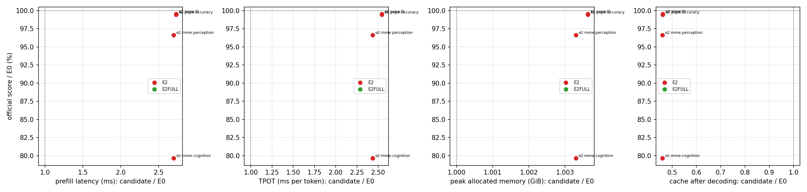

# Prefix-TTT 全量微调实验总结（E2-full）

本目录 `docs/experiments/2026-09-12-prefix-ttt-fullft/` 是「把 E2 的 LoRA 微调换成全量微调」这一实验项目的稳定目录。
方案见 `plan.md`，逐条过程记录见 `ledger.md`，混合精度原理见 `mixed_precision.md`。

## 1. 目标与判据

在**完全相同的**训练数据、manifest、步数与评测协议下，把 E2 的 LoRA 适配器换成对基座权重的全量微调，
观察官方 benchmark 分数能否提高。判据（`plan.md` 第 1 节）：

| 判据 | 阈值 | 结果 |
| --- | --- | --- |
| 主判据：MME perception | > 1429.4893（超过 E2） | ✅ **1456.9744** |
| 目标：MME perception | ≥ 1479.6432（追平 E0） | ❌ 1456.9744，差 22.67 |
| 次要：POPE accuracy | > 0.8501 | ✅ **0.8541** |
| 完成性 | 5182 步、`complete=true`、loss 全程有限 | ✅ |

**结论：全量微调有效，但不足以追平未训练的基座。**

## 2. 做了什么

### 2.1 唯一变量

被优化的参数集合：从「LoRA 适配器（80.0 M）+ TTT（27.1 M）」变成
「基座 LLM 全量（6.61 B）+ projector（21.0 M）+ TTT（27.1 M）」，可训练参数 107.1 M → **6787.1 M（63 倍）**。
数据、A 阶段、5182 步、batch、warmup、cosine、clip、评测协议全部不变。

冻结的只有 **CLIP ViT-L/14-336（303.5 M）**，按用户决定保持。

### 2.2 两阶段

- **A 阶段**（`transfer.py`，16 卡，391 步，8 分钟）：只训练 TTT 模块，基座冻结，产出 TTT 初始化。
- **B 阶段**（`sft.py --trainable full`，16 卡，5182 步，3.48 h）：上表全部可训练参数一起训练，
  TTT 用 `new_module_lr=1e-4`、基座用 `base_lr=2e-5`，共用一套 cosine 调度。

### 2.3 并行与优化器：三次演进，最终方案

| 方案 | 每卡显存 | 结果 |
| --- | --- | --- |
| ① fp32 参数 + `ZeroRedundancyOptimizer` + 原版 AdamW | 78.4 GiB（98.5%） | 第 12 步**卡死**（功耗 147 W 自旋），放弃 |
| ② 下调 `micro_batch_size` 8→4 | 78.40 GiB | **几乎无效**（只回收 0.6 GiB），放弃 |
| ③ **bf16 参数 + 分片 fp32 master** | **42.1 GiB（53%）** | ✅ 采用 |

关键量化事实：fp32 训练下显存几乎全是"模型尺寸"项——fp32 参数 26.4 + fp32 梯度 25.2 + 优化器分片 3.2 +
autocast 权重副本约 13 ≈ 68 GiB 与批量无关，只有约 5 GiB 激活随 `micro` 变，**所以调 micro 治不了这个病**。

最终方案只新增一个 45 行的 `MasterWeightAdamW`（`src/prefix_ttt/optim.py`）：把 fp32 master 与 Adam 动量
放进 **`optimizer.state`**，因为 ZeRO 只分片优化器状态；若 master 作为模块参数存在，会被 ZeRO 每步的
参数广播复制到所有 rank。这样权重本身留 bf16（正是前向原本的计算 dtype），master 可被 16 卡分片。
`ZeroRedundancyOptimizer` 的「同一优化器内 dtype 必须一致」约束因此自然满足：bf16 基座进 ZeRO，
fp32 的 TTT（27 M）进另一个普通 AdamW，并加了断言防止漂移。

## 3. 结果

### 3.1 官方分数（lmms-eval 0.7.2，同一 prompt 与打分器）

| 臂 | MME perception | MME cognition | POPE accuracy | POPE F1 |
| --- | --- | --- | --- | --- |
| E0（不训练，官方 LLaVA-1.5-7B） | 1479.6432 | 349.2857 | 0.8548 | 0.8397 |
| E2（A + TTT + LoRA） | 1429.4893 | 278.2143 | 0.8501 | 0.8357 |
| **E2-full（A + TTT + 全量微调）** | **1456.9744** | **297.5000** | **0.8541** | **0.8392** |

**相对 E2：四项指标全部提高**——MME perception +27.4851、cognition +19.2857、POPE acc +0.0040、F1 +0.0035。

**相对 E0 的差距追回比例**：

| 指标 | E2 落后 E0 | E2-full 落后 E0 | 追回 |
| --- | --- | --- | --- |
| MME perception | 50.1539 | 22.6688 | **54.8 %** |
| MME cognition | 71.0714 | 51.7857 | 27.1 % |
| POPE accuracy | 0.0047 | 0.0007 | **85.1 %** |

POPE 的 0.0007 差距相当于 9000 条里的约 6 条，可视为与基座持平。

### 3.2 训练曲线（同 5182 步、同数据顺序）

| | E2 (LoRA) | E2-full |
| --- | --- | --- |
| step 100 loss | 2.2056 | **1.2911** |
| step 500 loss | 1.0930 | **0.9287** |
| 末 50 步均值 | 0.7745 | **0.7339** |
| grad_norm 中位数 | 2.258 | 1.992 |
| 非有限 loss | 0 | 0 |
| 墙钟 | 3.83 h | **3.48 h** |

全量微调收敛更快、最终训练 loss 低 5.2 %，且更快跑完（少了 LoRA 的额外矩阵乘）。

### 3.3 推理成本：架构未变，成本未变

- **缓存逐位相同**：E2 与 E2-full 均为 Full KV 90.3 + TTT 状态 46.0 + Local-32 11.5 = **147.8 MiB**（MME 口径）。
- **峰值显存** 13.52 vs 13.61 GiB，差异在噪声量级。
- **延迟无系统差异**：把 E2 权重放到与 E2-full **同样的 2 并发条件**下重测，得
  MME 62.10/31.12 ms、POPE 62.29/31.67 ms，对比 E2-full 的 62.58/31.47、60.65/30.27，
  比值 1.008×/1.011× 与 0.974×/0.956×——**差异在两个任务上符号相反，量级 ±1–4 %**。

> 一处必须记录的测量陷阱：E2 原记录的 prefill 78.92 ms 来自 4 并发的跑批，同条件下重测为 62.10 ms，
> **21 % 的差异全部是并发造成的**。本次若不做同条件重测，就会把测量假象误报成"全量微调更快"。
> 该重测同时逐位复现了 E2 的分数（1429.4893 / 278.2143 / 0.8501 / 0.8357），证明条件可靠。

## 4. 成功与失败

**成功**：

1. 主判据与次要判据达成：全量微调在本数据与配方下**确实优于 LoRA**，且是四项指标一致提高而非单项偶然。
2. POPE 基本追平未训练的基座。
3. 推理成本未因训练方式改变而变差——架构没变，缓存、显存、延迟均一致。

**失败**：

1. **未追平 E0 的 MME perception（差 22.67）与 cognition（差 51.79）**。也就是说，
   即便把基座全部权重都放开训练，TTT 混合架构在这个数据与配方下仍比原始 LLaVA-1.5 低约 23 分。
2. 三次显存架构返工，多花约 1 小时 GPU 时间与一轮 3.6 h 的失败尝试（第 12 步卡死）。

**对失败的解释（属分析，非结论）**：MME cognition 的差距（51.79）远大于 perception（22.67），
提示差距更多落在需要推理与常识的子任务上；这与"基座权重被 1 个 epoch 的 LLaVA-665k 全量更新后
发生一定程度的分布偏移"相符，也与 TTT 层替换掉 23/32 层的全局注意力这一结构改动相符。
两者在本实验里无法分离——这正是原本计划中"无 TTT 的纯 LLaVA 全量微调"对照臂要回答的问题，
而该对照臂按用户决定未运行。

## 5. 过程中的工程问题（可复用的记录）

1. **既有缺陷：`load_manifest` 缺 `digest_json` 导入**。这是 `16d67fe` 那次重构的遗留，
   使**正式训练入口第一步就崩**。之所以十天未被发现，是因为重构的验证只覆盖评测路径，
   而评测不读 manifest。已修复三处同类缺失导入并补 3 项测试。**教训：重构的验证范围必须覆盖所有入口。**
2. **`prepare_sample` 的 `torch.no_grad()` 切断了 `embed_tokens` 与 `mm_projector` 的梯度**：
   这两个模块的前向在数据管线内部完成，全量微调若沿用固定 `no_grad` 会静默地永不更新它们
   （表现为 `RuntimeError: Missing trainable gradient`）。LoRA 路径从未暴露，因为那里本就冻结。
3. **fp32 权重导致 FLA kernel dtype 报错**：`F.embedding` 在 fp32 权重下返回 fp32（`F.linear` 则返回 bf16），
   使残差流变 fp32 → HF 的 `LlamaRotaryEmbedding` 按 hidden dtype 生成 cos/sin → 旋转后 q/k 被提升为 fp32
   → `hybrid.py` 判定 autocast 不可用 → `features_pair` 输出 fp32，与 bf16 的 v 一起进入 kernel 报
   `Both operands must be same dtype`。修复是把多模态嵌入保持 bf16。
4. **`ZeroRedundancyOptimizer` 的 dtype 约束是"每个实例内部"的**，不是全局的；
   且它不分片梯度与参数（那是 ZeRO-2/3），只分片优化器状态。
5. **跑批之间不可比**：并发数不同造成 21 % 的延迟差异，见 3.3 节。

## 6. 结论与后续方向

**结论**：把 LoRA 换成全量微调，在本数据与配方下把 E2 的 MME perception 从 1429.49 提到 1456.97
（追回与基座差距的 54.8 %），POPE 追平基座，且推理成本不变。但 TTT 混合架构相对原始 LLaVA-1.5
仍有约 23 分的 MME perception 与约 52 分的 cognition 差距，**全量微调不足以弥合**。

**可继续的方向**（均未在本阶段执行）：

1. 补做「无 TTT 的纯 LLaVA 全量微调」对照臂，分离"架构代价"与"数据/配方代价"。
2. 降低基座学习率或改用分层学习率，检验 cognition 的落后是否来自基座偏移。
3. 训练更长时间或换更大数据，检验 1 epoch 665k 是否是瓶颈。
4. 端到端重测三臂推理成本（本阶段只对 E2/E2-full 做了同条件重测）。

## 7. 产物位置

- 训练：`/data/shared/weights/prefix-ttt/training/A-full/`、`training/E2-full/`（`latest.pt` 14.2 GB +
  16 个优化器分片 + `steps.jsonl` + `result.json`）。
- 评测：`/data/shared/weights/prefix-ttt/eval-full/`（E2-full）、`eval-recheck/`（同条件重测的 E2）、
  `eval-controlled/`（三臂合并口径，供绘图脚本消费），逐请求成本在各自的 `cost/` 下。
- 本目录：`plan.md`、`ledger.md`、`mixed_precision.md`、`metrics-summary.json`、`images/`（三张图）、
  `scripts/`（启动、评测、绘图脚本）。
